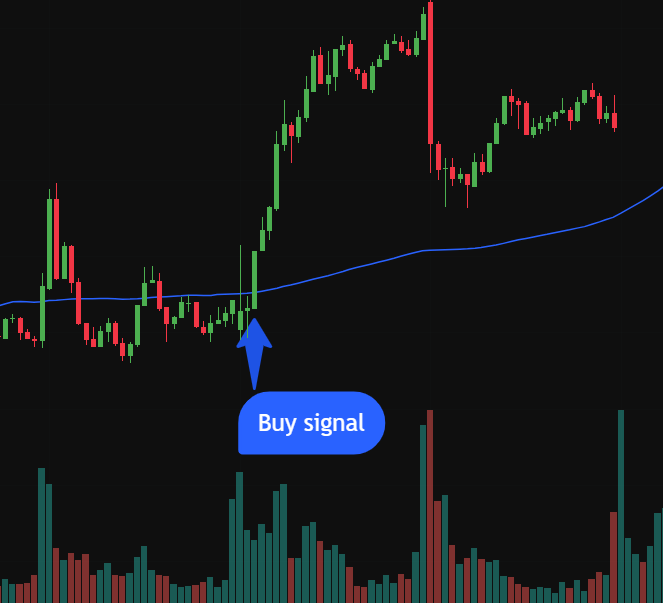
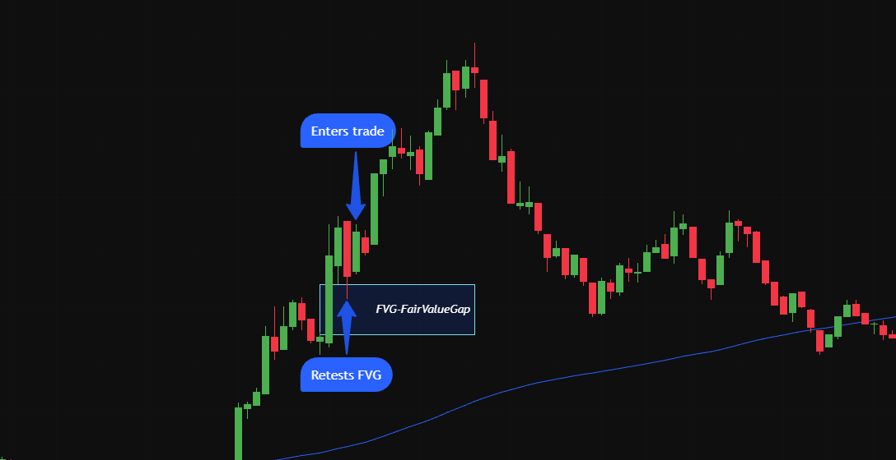
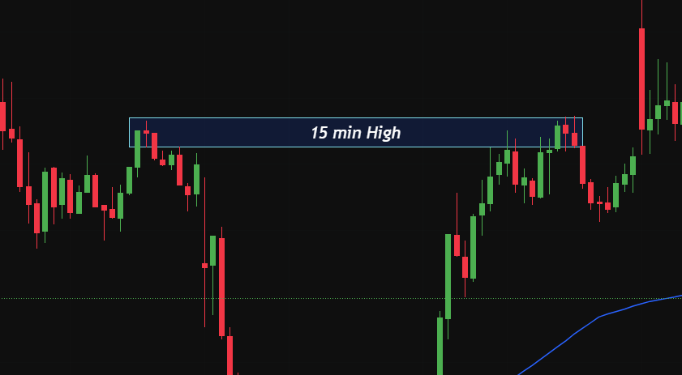
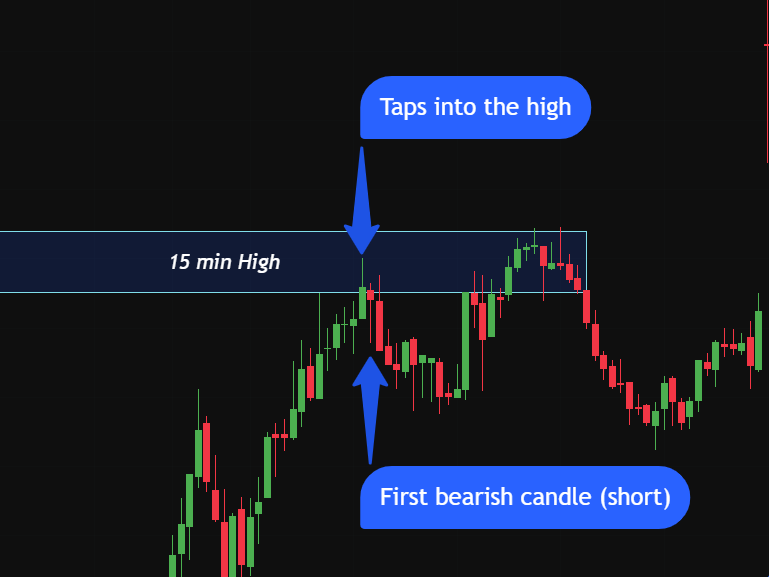

Before reading this we urge you to read through the Specification where we go through all the concepts involved.

1. General Strategy: Trace when the stock crosses above or below a chosen SMA, and combine that with market time and volume to decide whether to buy or sell.

1. General Strategy: Track when price crosses a chosen SMA and combine that signal with market time and volume to filter out weak setups. The idea is that an SMA cross by itself produces a lot of false signals, so we only act on crosses that happen during high-volume periods when the move is more likely to follow through.

Entry and Stop-Loss: We use a longer SMA, the 100 day average to generate the signal. A close above the SMA after trading below it triggers a long, and a close below it after trading above triggers a short. The cross has to happen within the first few hours after market open, where volume is highest and moves tend to have conviction. Crosses that occur midday in low-volume conditions are ignored. Volume on the signal candle should also be visibly above the recent average, otherwise we treat the cross as noise. The stop-loss is placed on the opposite side of the SMA, just beyond the swing low (for longs) or swing high (for shorts) that formed before the cross, and we target 2x the risk.

2. General Strategy: Look for a fair value gap (FVG) and use the 100-day SMA to determine the overall trend of the stock. If we're in an uptrend we only take longs, and in a downtrend we only take shorts. All trades are executed within the first few hours after market open to ensure adequate volume.

Entry and Stop-Loss: An FVG is formed by three candles, as shown in the image above. It indicates an imbalance between buyers and sellers, and is valid when the low of the third candle is higher than the high of the first candle. If those two wicks overlap, there is no gap and the setup is invalid. We wait for price to retrace back into the FVG, and once the first bullish candle forms inside the gap we enter the trade. The stop-loss is placed just below the FVG, and we target 1.5x the risk.

3. General Strategy: Mark out highs and lows on the 15-minute timeframe, then drop down to a lower timeframe to analyze the entry. We're looking for price to trade above a marked high but close back below it, followed by a bearish candle on the next bar to confirm the short.

Entry and Stop-Loss: Areas of interest are mapped out on the 15-minute timeframe. These are significant highs and lows where resting orders are likely to sit. As price approaches one of these zones we switch to a lower timeframe and wait for price to trade into it. We then need confirmation that price will reverse. That is by a bearish candle (for shorts) or a bullish candle (for longs) forming inside the zone. The stop-loss is placed above the swing high of the sweep, and we target 2x the risk.

Note: if price trades above our zone but closes back inside it, we've got a liquidity sweep. It is a move designed to trigger the orders resting above the high. The mechanics are worth understanding. Say a large player wants to sell 1,000 contracts. There aren't enough buyers at the current price to fill that size without significant slippage, so they need buyers to appear. They know stop-losses from short sellers are sitting above the previous high, and that those stops are technically buy orders. Closing a short requires buying back the borrowed shares. By either pushing price up to that level or simply waiting for it to get there naturally, all those stops trigger as market buys at once. The large player offloads their position into that forced buying. Once the stops are filled there's no real demand left, so price typically drops back down, which is exactly what creates the sweep pattern on the chart.