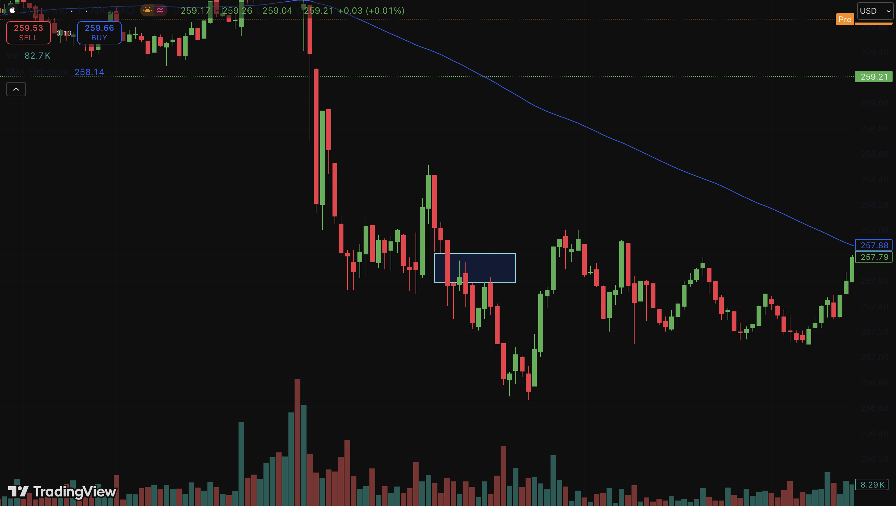

1. Trace when the stock goes above or below a certain sma, combined with market time and  volume we will buy/sell the stocks.

2. See when a fairvalue-gaps (FVG) appears, use a 100 day SMA to detect the overall trend of the stock. If we are in an uptrend then we will only buy and in a downtrend we will only sell. All trades will be performed within a few hours of when the market has opened to ensure adequate volume.

3. Identify lows and highs on  a 15 min timeframe, analyze the market using a lower timeframe. Detect when the market goes above the high but closes below it, then look for a bearish move at the second candle, confirming a short position.
